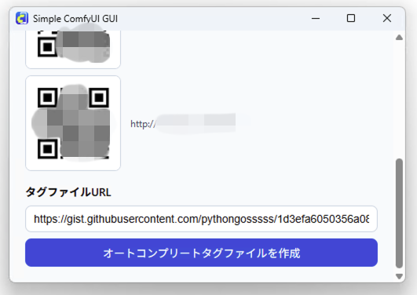
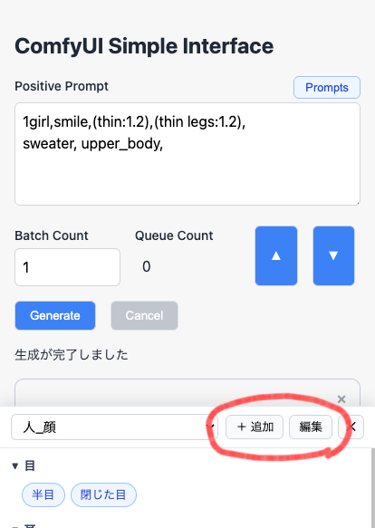

# ComfyUI Simple Interface GUI

外出先のスマホからComfyUIを使って画像生成をしたい、という思いから作ったツールです。

過去に作った [ComfyUI Simple Interface](https://github.com/da2el-ai/simple-comfyui) と違ってデスクトップアプリなので、環境構築の手間がなく簡単に使えるようになっていると思います。

フロントエンド部分はまるっと作り直し＆機能強化しています。

<table>
  <tr>
    <td>
    <figure>
    <figcaption>▲生成画面</figcaption></figure>
    </td>
    <td>
    <figure>
    <figcaption>▲生成画像ギャラリー</figcaption></figure>
    </td>
  </tr>
  <tr>
    <td>
    <figure>
    <figcaption>▲オートコンプリート</figcaption></figure>
    </td>
    <td>
    <figure>
    <figcaption>▲プロンプトセレクター</figcaption></figure>
    </td>
  </tr>
</table>

## 主な機能

- LAN内のComfyUIにスマホからアクセスしてシンプルなユーザーインターフェイスで画像生成ができる
- タグのオートコンプリート機能
- 登録済みプロンプトの呼び出し機能
- ワークフローを自由に追加・カスタマイズ可能

## 動作要件

- ComfyUIが動作するWindowsまたはMac
- 同一ネットワーク内、またはVPN経由で上記PCに到達できるスマホ/PC
- ComfyUIを `--enable-cors-header` 付きで起動していること

## インストール方法

### ComfyUI側の事前準備

ComfyUIの起動オプションに下記を付けて起動してください。

- `--enable-cors-header`
- `--listen {ComfyUIが起動しているPCのIPアドレス}`

`127.0.0.1` や `localhost` だと他の端末からアクセスできません。<br>
`192.168.xxx.xxx` のようなLAN内のアドレス、またはTailscaleによって割り当てられたIPアドレスを使ってください。


### ダウンロードと起動

1. [Release](https://github.com/da2el-ai/simple-comfyui-gui/releases/) から自分のOSに合ったZIPファイルをダウンロード

1. ZIPファイルを展開し、実行ファイル `Simple ComfyUI GUI` を起動<br>

1. `ComfyUI URL` にComfyUIのURLを入力し `ComfyUIに接続` をクリック<br>

1. 接続成功するとスマホからアクセスするためのQRコードが表示される
1. スマホでQRコードを読み取りサイトを開く

※PCから動作確認をしたければ `SimpleComfyUI を起動` をクリックすればブラウザからアクセスできます。

### 外出先からアクセスするには

VPNが必要です。個人的には Tailscale が簡単でおすすめです。

<a href="https://tailscale.com/">https://tailscale.com/</a>


## よくあるトラブル

### 接続できない

- URLが `127.0.0.1` や `localhost` だと接続できません
- URLに `/` の付け忘れ、ポート番号の間違いがないか確認してください
- ComfyUIが起動中か確認してください
- WindowsファイアウォールでComfyUIのポートがブロックされていないか確認してください

### 画像生成できない

- 使用中ワークフローに必要なカスタムノードがインストールされているか確認してください
- ワークフロー設定YAMLの `required` / `optional` の対応先が実ワークフローと一致しているか確認してください


## プロンプトオートコンプリート

プロンプトの補間機能を使うには `{インストールフォルダ}/tags/autocomplete.csv` を用意する必要があります。

QRコードの下、「オートコンプリートタグファイルを作成」をクリックすると作成されます。<br>
これは [ComfyUI-Custom-Scripts](https://github.com/pythongosssss/ComfyUI-Custom-Scripts) の [Gist](https://gist.githubusercontent.com/pythongosssss/1d3efa6050356a08cea975183088159a/raw/a18fb2f94f9156cf4476b0c24a09544d6c0baec6/danbooru-tags.txt) から取得しています。




## プロンプトセレクター

ポジティブ、ネガティブプロンプトの上にある `Prompts` ボタンをクリックすると登録したプロンプトを呼び出せます。

編集は下記のいずれかの方法で行えます。

- プロンプトセレクターから「追加」「編集」をクリック
- `{インストールフォルダ}/selector/` 内のYAMLファイルを直接編集




## 同梱のワークフローについて

ワークフローは `Advanced Settings` の最下部で切り替えることができます。

- `Simple_t2i`
  - 標準ノードのみを使用したシンプルなtxt2imgワークフローです。
  - ComfyUIの初期画面で出てくるものと同じです。
- `D2_t2i`
  - 拙作[D2 Nodes](https://github.com/da2el-ai/d2-nodes-comfyui)のインストールが必要です。
  - 画像の保存先を[Eagle](https://jp.eagle.cool/)にしています。


## ワークフローのカスタマイズ

自分が普段使っているワークフローを使うことも可能です。

1. ComfyUIのメニューから `Export (API)` で保存
1. 保存したワークフローを、`{Simple ComfyUI GUIインストールフォルダ}/workflow/` フォルダに移動
1. 既存のYAMLファイルを複製して、名前を `{ワークフローのファイル名}.yaml` に変更
1. ワークフローの内容にあわせてYAMLファイルを編集

```
+-- Simple ComfyUI GUI
+-- /workflow
    +-- my-workflow.json  # ワークフロー
    +-- my-workflow.yaml  # ワークフロー設定ファイル
```


### ワークフロー（JSON）の構造

まずはワークフローの構造を知っておく必要があります。

下記はワークフローから `D2_KSampler` の部分を抜粋したものです。<br>
これを念頭に置いて以降の説明をお読みください。

```json
{
  "14": {                            # ID
    "inputs": {
      "seed": 913571682214506,       # 入力項目の名前と値
      "steps": 20,
      〜〜省略〜〜
    },
    "class_type": "D2 KSampler",     # ノードの名前
    "_meta": {
      "title": "D2 KSampler"         # ノードの表示名
    }
  },
}
```

### ワークフロー設定ファイル（YAML）

ワークフローをSimpleComfyUIで使用するための設定ファイルです。<br>
ワークフローの内容に合わせて変更する必要があります。

#### 画像を出力するノードのID（通常はKSampler）

上記のワークフローでは `D2 KSampler` を使っているので、そのノードIDを記載します。

[NAIDGenerator](https://github.com/bedovyy/ComfyUI_NAIDGenerator) のように画像を表示しないノードの場合は `Save Image` など画像保存ノードを指定してください。

```yaml
output_node_id: 14
```

#### 必須の入力項目

Positive / Negativeプロンプト、Checkpointローダー、Seedです。

```yaml
required:
  -
    id: "positive"
    workflow:
      search_type: "title"
      search_value: "Positive"
      input_name: "prompt"
  -
    id: "negative"
    workflow:
      search_type: "title"
      search_value: "Negative"
      input_name: "prompt"
  -
    id: "checkpoint"
    workflow:
      search_type: "id"
      search_value: 10
      input_name: "ckpt_name"
  -
    id: "seed"
    workflow:
      search_type: "class_type"
      search_value: "D2 KSampler"
      input_name: "seed"
```

上記の `positive` について説明します。

Positiveプロンプトはワークフローでは下記のようになっています。<br>
カスタムノードの名前は `D2 Prompt` ですが、表示名を `Positive` に変更しています。そのため `search_type: "title"` として表示名から検索しています。

```json
# ワークフローのPositiveプロンプト入力部分
  "16": {
    "inputs": {
      "prompt": "1girl",
      "comment_type": "# + // + /**/",
      "insert_lora": "CHOOSE",
      "token_count": false
    },
    "class_type": "D2 Prompt",
    "_meta": {
      "title": "Positive"
    }
  },
```

#### 必須の入力項目（required）のパラメーター

- `id`: 名前は固定なので変更禁止
- `search_type`: 該当ノードの検索対象
  - `class_type`
  - `title`
  - `id`
- `search_value`: 該当ノードの検索ワード
- `input_name`: 入力名


#### 追加の入力項目（optional）

ワークフロー毎に追加できる設定項目です。

下記はプルダウンメニュー（Image Size Preset）と数値入力（Width）の例です。<br>
`size_preset` では `D2 Size Selector` のプリセット名を `["D2 Size Selector", "input", "required", preset, 0]` という順番に辿って取得しています。

```
optional:
  -
    id: "size_preset"
    input:
      title: "Image Size Preset"
      type: "list"
      value: ["D2 Size Selector", "input", "required", preset, 0]
    workflow:
      search_type: "class_type"
      search_value: "D2 Size Selector"
      input_name: "preset"
  -
    id: "width"
    input:
      title: "Width"
      type: "number"
      default: 1024
    workflow:
      search_type: "class_type"
      search_value: "D2 Size Selector"
      input_name: "width"
```

#### 追加の入力項目（optional）のパラメーター

- `id`: 他とバッティングしない一意の名前
- `title`: 表示名
- `type`: 入力項目のタイプ
  - `text`: 文字列
  - `textarea`: 複数行テキスト
  - `number`: 数値
  - `list`: リスト
- `default`: 初期状態で表示する内容
- `value`: 初期状態で表示する内容。リストなど変更不可なもので使う
  -  カスタムノードから値を取得するにはワークフローを辿る配列を指定する。 
  -  `["D2 Size Selector", "input", "required", preset, 0]`
- `search_type`: 該当ノードの検索対象
  - `class_type`
  - `title`
  - `id`
- `search_value`: 該当ノードの検索ワード
- `input_name`: 入力名


## ライセンス

MIT

