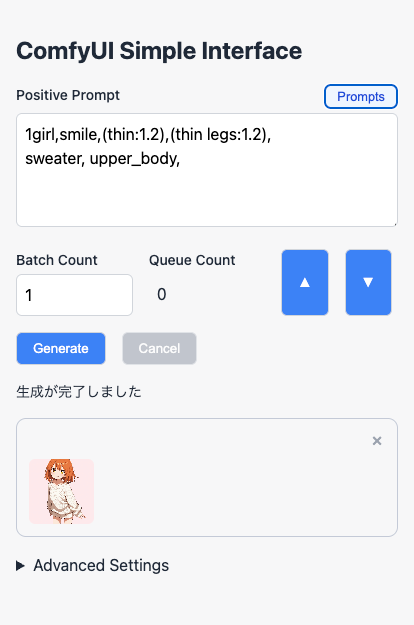
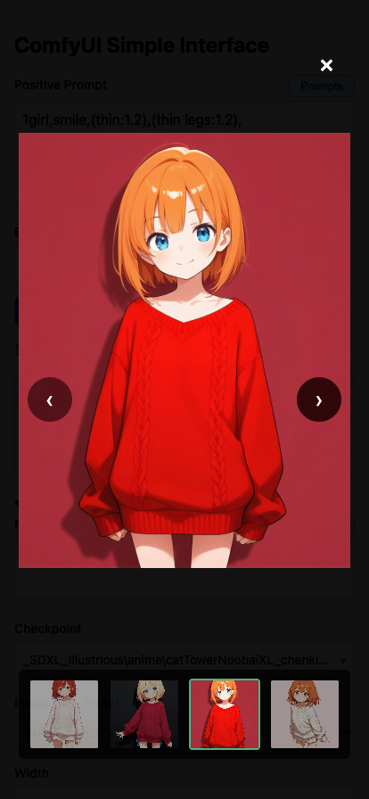
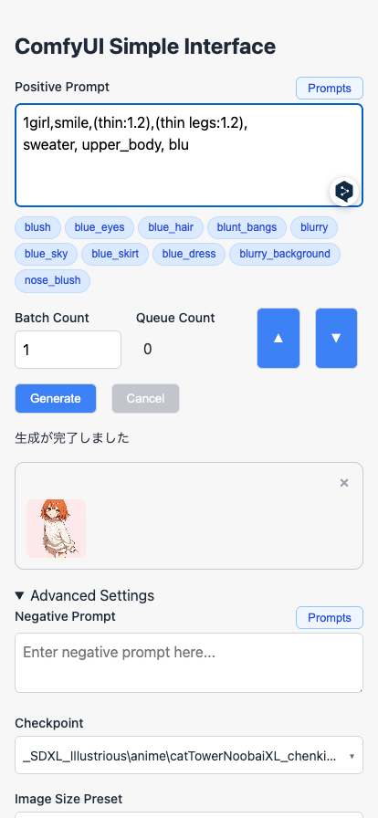
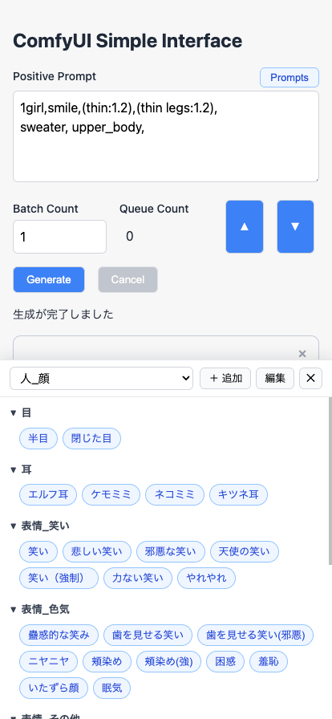
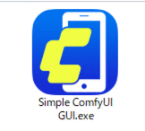
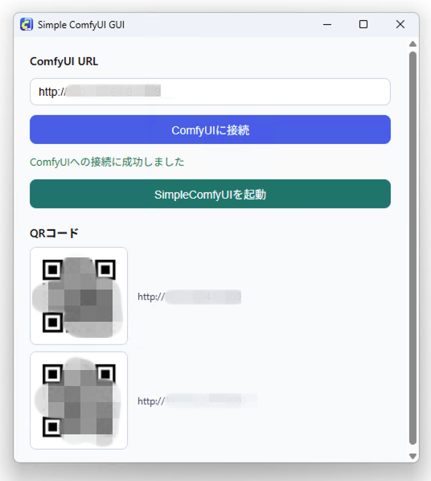

# ComfyUI Simple Interface GUI

外出先のスマホからComfyUIを使って画像生成をしたい、という思いから作ったツールです。

過去に作った [ComfyUI Simple Interface](https://github.com/da2el-ai/simple-comfyui) と違ってデスクトップアプリなので、環境構築の手間がなく簡単に使えるようになっていると思います。

フロントエンド部分はまるっと作り直し＆機能強化しています。

<table>
  <tr>
    <td>
    <figure>
    <figcaption>▲生成画面</figcaption></figure>
    </td>
    <td>
    <figure>
    <figcaption>▲生成画像ギャラリー</figcaption></figure>
    </td>
  </tr>
  <tr>
    <td>
    <figure>
    <figcaption>▲オートコンプリート</figcaption></figure>
    </td>
    <td>
    <figure>
    <figcaption>▲プロンプトセレクター</figcaption></figure>
    </td>
  </tr>
</table>

## 主な機能

- LAN 内の Windows PC にスマホからアクセスして画像生成ができる
- タグのオートコンプリート機能
- 登録済みプロンプトの呼び出し機能
- ワークフローを自由に追加・カスタマイズ可能

## インストール方法

### ComfyUI側の事前準備

ComfyUIの起動オプションに `--enable-cors-header` を付けて起動してください。

### ダウンロードと展開

[Release](https://github.com/da2el-ai/simple-comfyui-gui/releases/) から自分のOSに合ったZIPファイルをダウンロードしてください。

ZIPファイルを展開し、`Simple ComfyUI GUI`という実行ファイルを起動します。




### ComfyUIのURLを入力して起動



`ComfyUI URL` にComfyUIのURLを入力し `ComfyUIに接続` をクリックします。接続成功するとスマホからアクセスするためのQRコードが表示されます。

PCから動作確認をしたければ `SimpleComfyUI を起動` をクリックすればブラウザからアクセスできます。

### 外出先からアクセスするには

VPNが必要です。個人的には Tailscale が簡単でおすすめです。

<a href="https://tailscale.com/">https://tailscale.com/</a>

## 動作要件

- ComfyUI が動作する PC
- 同一ネットワーク内、または VPN 経由で PC に到達できるスマホ/PC
- ComfyUI を `--enable-cors-header` 付きで起動していること

## よくあるトラブル

### 接続できない

- URL に `/` の付け忘れ、ポート番号の間違いがないか確認してください
- ComfyUI 側が起動中か確認してください
- Windows ファイアウォールで ComfyUI のポートがブロックされていないか確認してください

### 画像生成できない

- 使用中ワークフローに必要なカスタムノードがインストールされているか確認してください
- ワークフロー設定 YAML の `required` / `optional` の対応先が実ワークフローと一致しているか確認してください


## 同梱のワークフローについて

ワークフローは `Advanced Settings` の最下部で切り替えることができます。

- `Simple_t2i`
  - 標準ノードのみを使用したシンプルなtxt2imgワークフローです。
  - ComfyUIの初期画面で出てくるものと同じです。
- `D2_t2i`
  - 拙作[D2 Nodes](https://github.com/da2el-ai/d2-nodes-comfyui)のインストールが必要です。
  - 画像の保存先を[Eagle](https://jp.eagle.cool/)にしています。


## ワークフローのカスタマイズ

自分が普段使っているワークフローを使うことも可能です。

### ワークフローの書き出し方

1. ComfyUIのメニューから「Export (API)」で保存します。
2. 保存したワークフローを、`{Simple ComfyUI GUIインストールフォルダ}/workflow/` フォルダに移動します。
3. ワークフローと同名のYAMLファイルを作成します。既存のYAMLファイルを複製して編集してもOKです。

```
+-- Simple ComfyUI GUI
+-- /workflow
    +-- my-workflow.json  # ワークフロー
    +-- my-workflow.yaml  # ワークフロー設定ファイル
```


### ワークフロー（JSON）の構造

まずはワークフローの構造を知っておく必要があります。

下記はワークフローから `D2_KSampler` の部分を抜粋したものです。<br>
これを念頭に置いて以降の説明をお読みください。

```json
{
  "14": {                            # ID
    "inputs": {
      "seed": 913571682214506,       # 入力項目の名前と値
      "steps": 20,
      〜〜省略〜〜
    },
    "class_type": "D2 KSampler",     # ノードの名前
    "_meta": {
      "title": "D2 KSampler"         # ノードの表示名
    }
  },
}
```

### ワークフロー設定ファイル（YAML）

ワークフロー設定（YAML）のパラメーターです。

#### 画像を出力するノードのID（通常はKSampler）

上記のワークフローでは `D2 KSampler` を使っているので、そのノードIDを記載します。

```yaml
output_node_id: 14
```

#### 必須の入力項目

Positive / Negative プロンプト、Checkpoint ローダー、Seedです。

```yaml
required:
  -
    id: "positive"
    workflow:
      search_type: "title"
      search_value: "Positive"
      input_name: "prompt"
  -
    id: "negative"
    workflow:
      search_type: "title"
      search_value: "Negative"
      input_name: "prompt"
  -
    id: "checkpoint"
    workflow:
      search_type: "id"
      search_value: 10
      input_name: "ckpt_name"
  -
    id: "seed"
    workflow:
      search_type: "class_type"
      search_value: "D2 KSampler"
      input_name: "seed"
```

上記の `positive` について説明します。

Positiveプロンプトはワークフローでは下記のようになっています。<br>
カスタムノードの名前は `D2 Prompt` ですが、表示名を `Positive` に変更しています。そのため `search_type: "title"` として表示名から検索しています。


```json
  "16": {
    "inputs": {
      "prompt": "1girl",
      "comment_type": "# + // + /**/",
      "insert_lora": "CHOOSE",
      "token_count": false
    },
    "class_type": "D2 Prompt",
    "_meta": {
      "title": "Positive"
    }
  },
```

#### 必須の入力項目（required）のパラメーター

- `id`: 名前は固定なので変更禁止
- `search_type`: 該当ノードの検索対象
  - `class_type`
  - `title`
  - `id`
- `search_value`: 該当ノードの検索ワード
- `input_name`: 入力名


#### 追加ノード

ワークフロー毎に追加できる設定項目です。

下記はプルダウンメニュー、数値入力の例です。<br>
`size_preset` では `D2 Size Selector` のプリセットを表示させるために `["D2 Size Selector", "input", "required", preset, 0]` という順番に探索しています。

```
optional:
  -
    id: "size_preset"
    input:
      title: "Image Size Preset"
      type: "list"
      value: ["D2 Size Selector", "input", "required", preset, 0]
    workflow:
      search_type: "class_type"
      search_value: "D2 Size Selector"
      input_name: "preset"
  -
    id: "width"
    input:
      title: "Width"
      type: "number"
      default: 1024
    workflow:
      search_type: "class_type"
      search_value: "D2 Size Selector"
      input_name: "width"
```

#### 追加の入力項目（optional）のパラメーター

- `id`: 他とバッティングしない一意の名前
- `title`: 表示名
- `type`: 入力項目のタイプ
  - `text`: 文字列
  - `textarea`: 複数行テキスト
  - `number`: 数値
  - `list`: リスト
- `default`: 初期状態で表示する内容
- `value`: 初期状態で表示する内容。リストなど変更不可なもので使う
  -  カスタムノードから値を取得するにはワークフローを辿る配列を指定する。 
  -  `["D2 Size Selector", "input", "required", preset, 0]`
- `search_type`: 該当ノードの検索対象
  - `class_type`
  - `title`
  - `id`
- `search_value`: 該当ノードの検索ワード
- `input_name`: 入力名


## ライセンス

MIT

