# ComfyUI Simple Interface GUI

外出先のスマホからComfyUIを使って画像生成をしたい、という思いから作ったツールです。

過去に作った [ComfyUI Simple Interface](https://github.com/da2el-ai/simple-comfyui) と違ってデスクトップアプリなので、環境構築の手間がなく簡単に使えるようになっていると思います。

フロントエンド部分はまるっと作り直し＆機能強化しています。

<table>
  <tr>
    <td>
    <figure>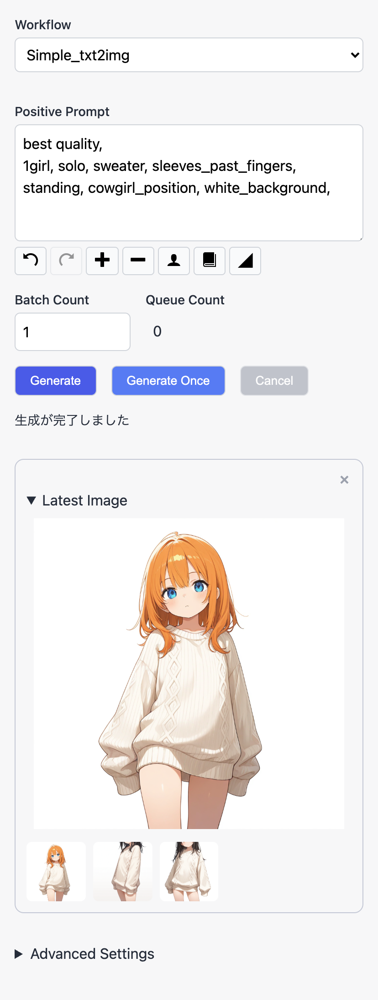
    <figcaption>▲生成画面</figcaption></figure>
    </td>
    <td>
    <figure>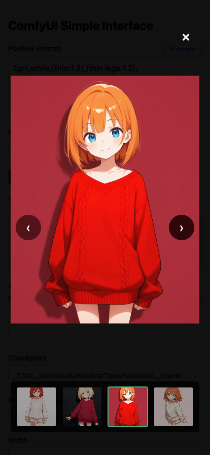
    <figcaption>▲生成画像ギャラリー</figcaption></figure>
    </td>
  </tr>
  <tr>
    <td>
    <figure>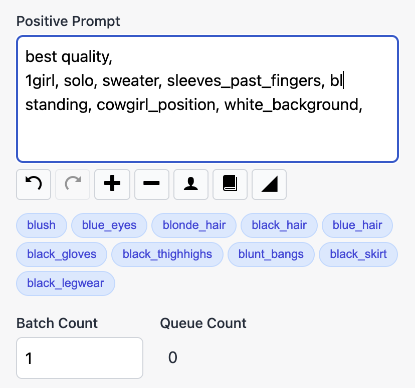
    <figcaption>▲オートコンプリート</figcaption></figure>
    </td>
    <td>
    <figure>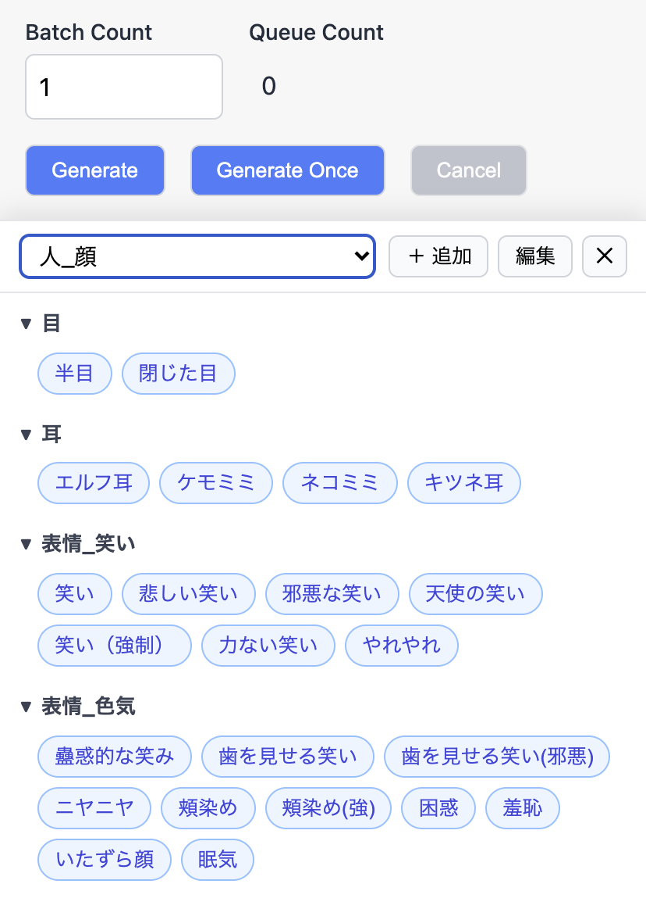
    <figcaption>▲プロンプトセレクター</figcaption></figure>
    </td>
  </tr>
  <tr>
    <td colspan="2">
    <figure>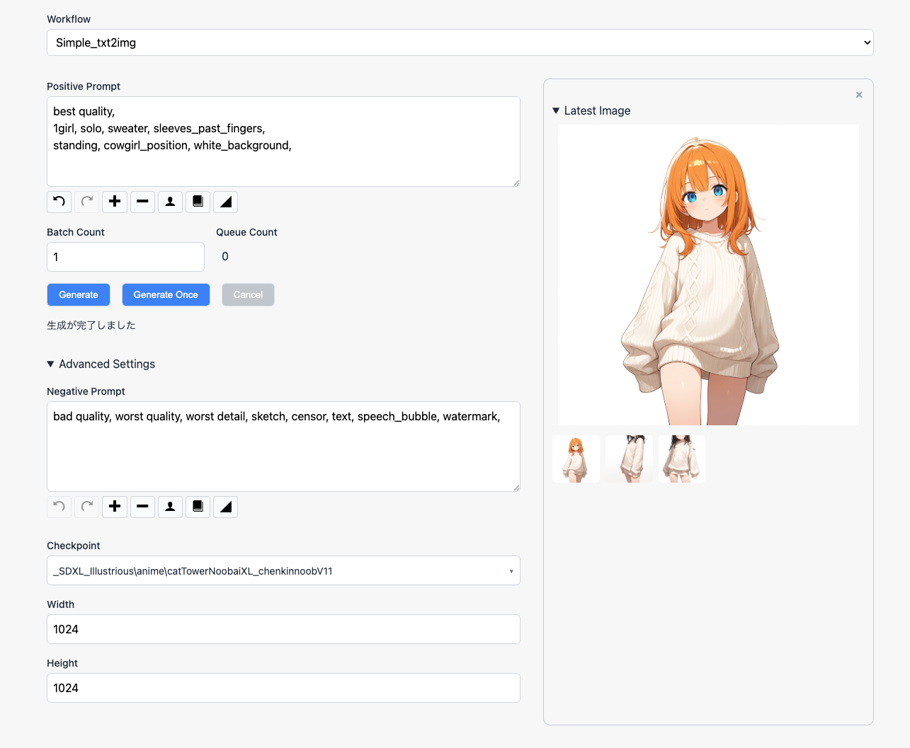
    <figcaption>▲PC版サイズ</figcaption></figure>
    </td>
  </tr>
</table>

## 主な機能

- LAN内のComfyUIにスマホからアクセスしてシンプルなユーザーインターフェイスで画像生成ができる
- タグのオートコンプリート機能
- 登録済みプロンプトの呼び出し機能
- ワークフローを自由に追加・カスタマイズ可能

## 動作要件

- ComfyUIが動作するWindowsまたはMac
- 同一ネットワーク内、またはVPN経由で上記PCに到達できるスマホ/PC
- ComfyUIを `--enable-cors-header` 付きで起動していること

## インストール方法

### ComfyUI側の事前準備

ComfyUIの起動オプションに下記を付けて起動してください。

- `--enable-cors-header`
- `--listen {ComfyUIが起動しているPCのIPアドレス}`

`127.0.0.1` や `localhost` だと他の端末からアクセスできません。 
`192.168.xxx.xxx` のようなLAN内のアドレス、またはTailscaleによって割り当てられたIPアドレスを使ってください。

### ダウンロードと起動

1. [Release](https://github.com/da2el-ai/simple-comfyui-gui/releases/) から自分のOSに合ったZIPファイルをダウンロード

1. ZIPファイルを展開し、実行ファイル `Simple ComfyUI GUI` を起動 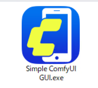

1. `ComfyUI URL` にComfyUIのURLを入力し `ComfyUIに接続` をクリック 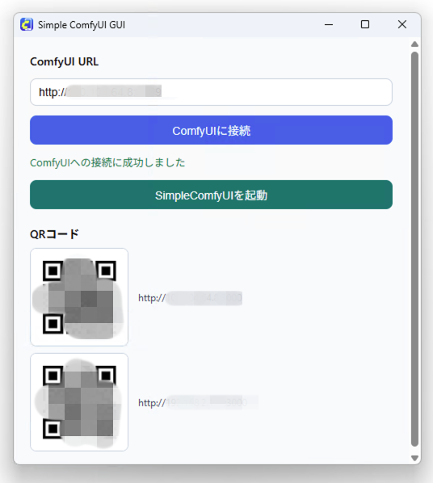

1. 接続成功するとスマホからアクセスするためのQRコードが表示される
1. スマホでQRコードを読み取りサイトを開く

※PCから動作確認をしたければ `SimpleComfyUI を起動` をクリックすればブラウザからアクセスできます。

### 外出先からアクセスするには

VPNが必要です。個人的には Tailscale が簡単でおすすめです。

<a href="https://tailscale.com/">https://tailscale.com/</a>

## 最初にやること

1. `Workflow` から `Simple_txt2img` を選択
2. `Advanced Settings` を開く
3. `Checkpoint` から好きなモデルを選択する
4. `Negative Prompt` にネガティブプロンプトを記述
5. `Positive Prompt` にポジティブプロンプトを記述
6. `Generate` クリックで生成

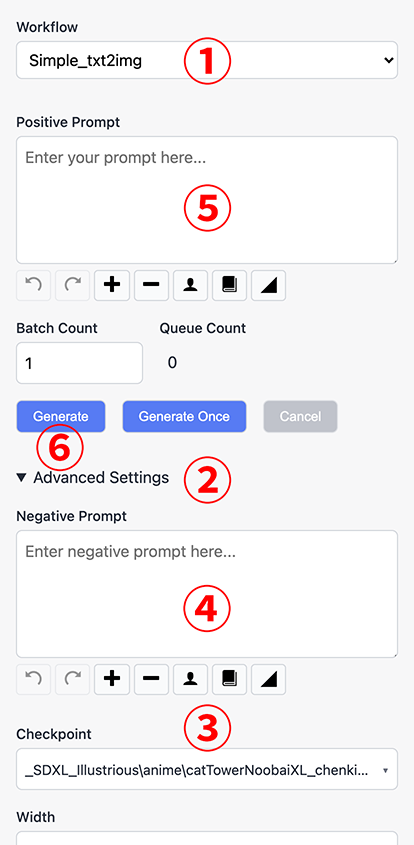

`Simple_txt2img` は標準ノードだけで構成されているので、最初に動作確認するにはおすすめです。

[D2 Nodes](https://github.com/da2el-ai/d2-nodes-comfyui) がインストール済みで、画像管理に [Eagle](https://jp.eagle.cool/) を使っている方は `D2_txt2img` がオススメです。

## よくあるトラブル

### 接続できない

- URLが `127.0.0.1` や `localhost` だと接続できません
- URLに `/` の付け忘れ、ポート番号の間違いがないか確認してください
- ComfyUIが起動中か確認してください
- WindowsファイアウォールでComfyUIのポートがブロックされていないか確認してください

### 画像生成できない

- 使用中ワークフローに必要なカスタムノードがインストールされているか確認してください
- ワークフロー設定YAMLの `required` / `optional` の対応先が実ワークフローと一致しているか確認してください

## プロンプトツールバー

プロンプト入力エリアの下にはツールバーがあります。

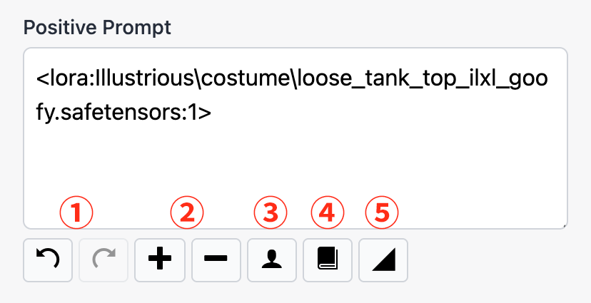

1. Undo, Redo
2. Wait増減
3. LoRA挿入
4. Prompt Selector
5. Text Area拡大・縮小

### LoRA挿入について

A1111方式でLoRAのプロンプトを挿入します。

**※注意** 
ワークフロー `simple_txt2img` では使えません。 
D2 KSampler を採用している `D2_txt2img` を使う必要があります。

## プロンプトオートコンプリート

プロンプトの補間機能を使うには `{インストールフォルダ}/tags/autocomplete.csv` を用意する必要があります。

QRコードの下、「オートコンプリートタグファイルを作成」をクリックすると作成されます。 
これは [ComfyUI-Custom-Scripts](https://github.com/pythongosssss/ComfyUI-Custom-Scripts) の [Gist](https://gist.githubusercontent.com/pythongosssss/1d3efa6050356a08cea975183088159a/raw/a18fb2f94f9156cf4476b0c24a09544d6c0baec6/danbooru-tags.txt) から取得しています。

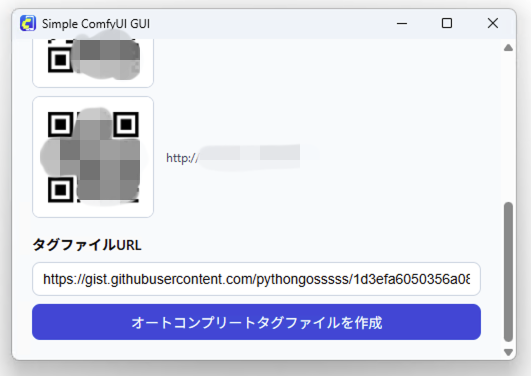

## プロンプトセレクター

ポジティブ、ネガティブプロンプトの上にある `Prompts` ボタンをクリックすると登録したプロンプトを呼び出せます。

編集は下記のいずれかの方法で行えます。

- プロンプトセレクターから「追加」「編集」をクリック
- `{インストールフォルダ}/selector/` 内のYAMLファイルを直接編集

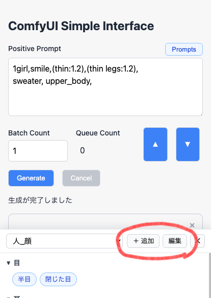

## インペイント

同梱のワークフロー `D2_img2img` を使ってください。 
`Advanced Settings` を開くと画像読み込みツールがあります。

読み込んだ画像をクリックするとマスクエディタが起動します。

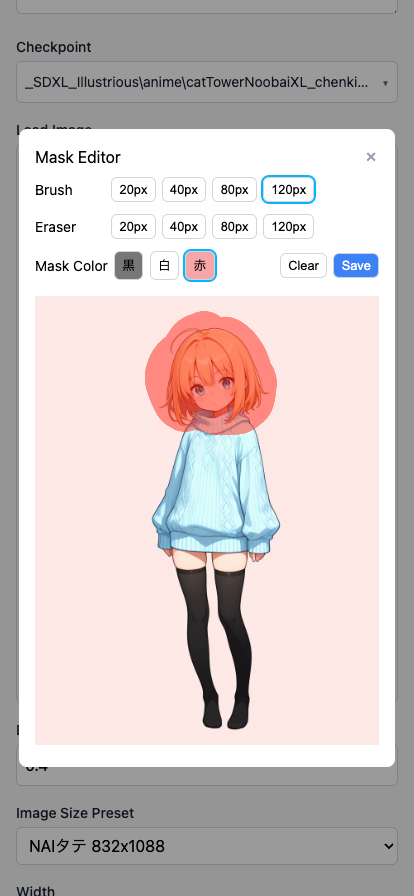

## キーボードショートカット

`Ctrl` と表記しているものは Mac では `Command` にも対応しています。

### 生成画面

| キー | 動作 |
|---|---|
| `Ctrl` + `Enter` | 生成開始（Generate ボタンと同等） |
| `Ctrl` + `Shift` + `Enter` | 1枚だけ生成開始（Generate Once ボタンと同等） |
| `Ctrl` + `↑` | カーソル位置の語のウェイトを +0.1 |
| `Ctrl` + `↓` | カーソル位置の語のウェイトを -0.1 |
| `Ctrl` + `/` | コメントアウト（`Simple_txt2img` ワークフローでは使えません） |
| `Ctrl` + `G` | ギャラリーを開く（プレビュー画像がある場合） |
| `↑` / `↓` | プロンプト候補の選択（プロンプト候補が表示している時） |

### ギャラリー

| キー | 動作 |
|---|---|
| `←` / `→` | 前後の画像に切り替え |
| `Esc` | ギャラリーを閉じる |

## 同梱のワークフローについて

ワークフローは `Advanced Settings` の最下部で切り替えることができます。

- `Simple_txt2img`
  - 標準ノードのみを使用したシンプルなtxt2imgワークフローです。
  - ComfyUIの初期画面で出てくるものと同じです。
- `D2_txt2img`
  - 拙作[D2 Nodes](https://github.com/da2el-ai/d2-nodes-comfyui)のインストールが必要です。
  - 画像の保存先を[Eagle](https://jp.eagle.cool/)にしています。
- `D2_img2img`
  - img2imgとインペイントを行うワークフローです。
  - 拙作[D2 Nodes](https://github.com/da2el-ai/d2-nodes-comfyui)のインストールが必要です。
  - 画像の保存先を[Eagle](https://jp.eagle.cool/)にしています。

### 追加のワークフロー

[Release](https://github.com/da2el-ai/simple-comfyui-gui/releases/) で追加のワークフローを配布しています。

詳細は [extra_workflow の README](./extra_workflow/README.md) をご覧下さい。

### ワークフローのカスタマイズ

[workflow.md](./docs/workflow.md) をご覧下さい。

## アプリケーションを改造したい

自由に行っていただいて構いません。

- バックエンド概要: [`README.md`](./app/README.md)
- フロントエンド概要: [`README.md`](./frontend/README.md)

## ライセンス

MIT

